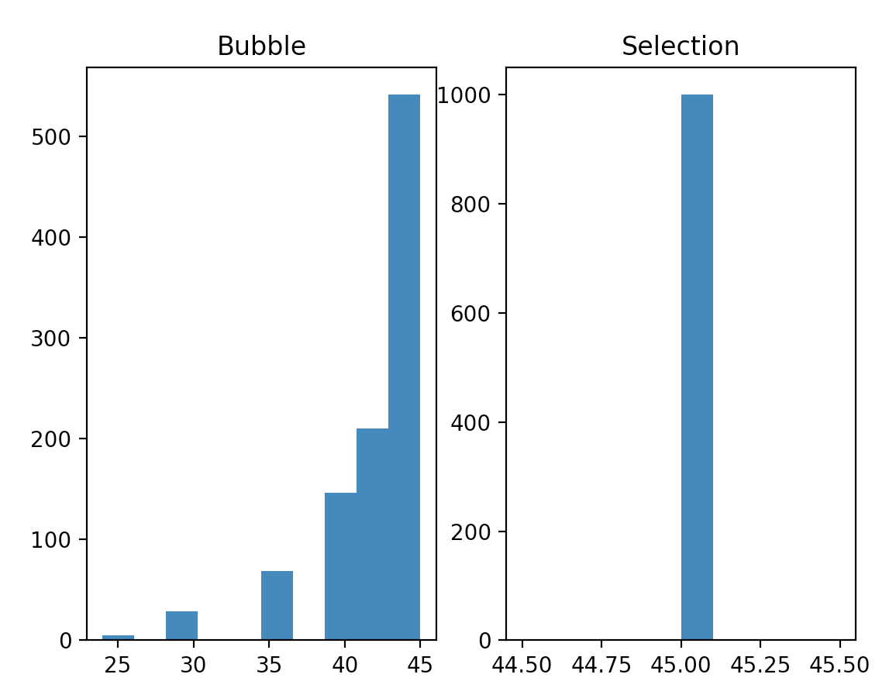

# Problem Set 10 (the last problem set!)

### Due Tuesday, May 4, 2021, at 11:59pm EST

As always, you will submit to Canvas **a single .zip file**. Detailed instructions for what the .zip file should contain are at the end of this problem set. 

Download this whole directory **to your desktop (!!!)**, unzip it, and carry out the tasks described below.

---

## Part 1: Using a Jupyter notebook

### Step 1: Installing jupyter
To use a Jupyter notebook, you need to install the `juypter` library. To do so, just follow [the directions in PS7 for installing libraries](https://github.com/CSC1-1101-TTh9-S21/ps7#step-1-install-the-libraries). In other words, launch a Terminal (Mac) or command (Windows) and type:

`pip3 install jupyter`

Be sure to check the alternative things to type in [the previous instructions for installing libraries](https://github.com/CSC1-1101-TTh9-S21/ps7#step-1-install-the-libraries) in case you have an unusual configuration.

### Step 2: Opening the jupyter notebook
Keep your terminal open! You need to navigate to the folder you downloaded in order to access the jupyter notebook, `part1.ipynb`. Recall that your `ps10-main` folder you downloaded must be on your desktop in order for these instructions to work. Here is how to do it:

* On a **Mac** or in Linux, in a terminal type: 

```
cd ~/Desktop/ps10-main
jupyter notebook
```

* On **Windows**, in the `command` or `cmd` application, type the following:

```
cd Desktop\ps10-main
```

If you get an error, try this instead, where `your-username` is your username.

```
cd c:\Users\your-username\Desktop\ps10-main
```

Then type

```
jupyter notebook
```

* On both Windows and Mac, this will open your default browser, and you'll see a screen that looks like this:

[INSERT SCREENSHOT HERE]

* Click on the file called `part1.ipynb` to complete Part 1 of the problem set.

### Step 3: Using a jupyter notebook
Continue with the rest of Part 1 by following the instructions in the provided jupyter notebook, `part1.ipynb`.

---

## Part 2: Using Atom and the terminal to develop and run your code 

### Step 1: Install Atom
[Download Atom from here](https://atom.io) and then double-click the downloaded file to unzip it. This will install Atom. Move the Atom icon to your Desktop since sometimes it works weirdly when it's in your Downloads directory.


### Step 2: Open a file in Atom
In Atom, go to `File -> Open`, navigate to this folder, and select `part2.py`.


### Step 3: Inspect and edit a file in Atom
Within Atom, insert a print statement just inside the outside for loop in each of the two sorting functions. Save the program by hitting `command-s` on Mac, `ctr-s` on Windows, or by going up to `File->Save`.


### Step 4: Run a Python program in a shell
* Open a Terminal (in Mac) or cmd (in Windows). Follow the steps in Part 1, Step 2 above to navigate to this folder using the `cd` command. 
* In the terminal or cmd Window, type the following

```
python3 part2.py
```

If you are on Windows, you might need to type:

```
python part2.py
```

You should see the output of the print statements you inserted.

### Step 5: Finish writing the program
Now you will finish writing `part2.py` to run a simulation to approximate the best case, worst case, and average case for bubble sort and selection sort. 

When you look at `part2.py` (**in Atom!**), you'll see that I have included the code for bubble sort and selection sort. 

* First, you will modify the code of these two functions to **keep track of and return** the number of comparisons that are made in one run of the function, where "comparison" means "anything that involves < or >.

* Next, in your `main()` function, you will create two empty lists `bubblelist` and `selectionlist`. You will generate 1000 different lists of length 10 of random integers using some function in the `random` library.  You will submit each list to the two sort methods and keep track of how many comparisons were required to sort each list. You will then report the minimum number of comparisons, the maximum number of comparisons, and the average number of comparisons for each sorting algorithm. Finally, you will plot an appropriate labeled histogram for each list.

* Remember that you should frequently test your program by saving it and running it! Insert **print statements** to debug as needed.

Below I have provided pseudo-pseudocode for you to implement in your `main()` function. This pseudocode is included as comments in the `part2.py` file.

```
declare bubblelist, selectionlist as empty lists
declare counter as an int equal to 0
while counter < 1000
   create list of length 10 containing ten random integers between 1 and 100 (duplicates are okay)
   make a copy of that list
   submit the first list to bubblesort()
   append the result to bubblelist
   submit the second list to selectionsort()
   append the result to selectionlist

print min, max, average of bubblelist
print min, max, average of selectionlist

create a plot with two subplots
plot histogram of bubblelist with appropriate labels
plot histogram of selectionlist with appropriate labels
```

Here is some output I got. Note that your exact numbers will be different since the lists are randomly generated.

```
Bubble sort:     min=24, max=45, mean=42.017
Selection sort:  min=45, max=45, mean=45.0
```



### Step 6: Document your use of Atom and the shell
Take a screenshot of your program in Atom and a screenshot of your output on the terminal/cmd so that I know you used Atom to write the program and the terminal/cmd to run the program.

---

## What to submit
Make sure that `part1.ipynb` and `part2.py` are complete and run as expected. Then make sure they are in your `ps10-main` folder, along with your two screenshots. Zip up the `ps10-main` folder, and submit the zipped file to Canvas.
 
 ### Due Tuesday, May 4, 2021, at 11:59pm EST


